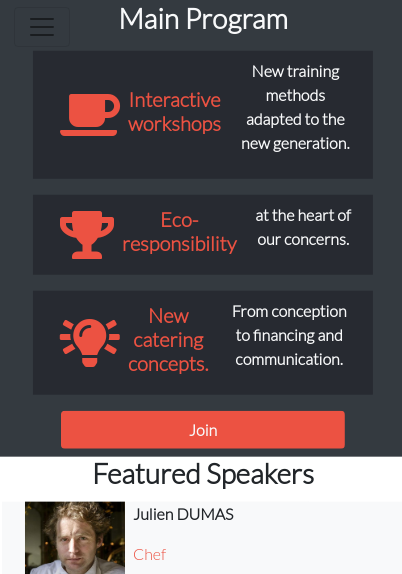

# Chef World Summit front-end design

> 3 days of conferences and interactive workshops will be led by the greatest Chefs and experts in the field

This project contains of 3 pages (Home page, About page, Schedule page), It is responsive in mobile and desktop screens.

## Built With

- HTML 5
- CSS 3
- Bootstrap 4
- VSC

## Live Demo

[Live Demo Link](https://bishoy-samwel.github.io/HTML-CSS-capstone-project/)

## Getting Started

To get a local copy up and running follow these simple example steps.

- Go to this [link] (https://github.com/Bishoy-Samwel/HTML-CSS-capstone-project/tree/capstone-project)
- Click on the green button code, Then click Download ZIP.
- Extract the ZIP file and open index.html on the browser.

## Authors

👤 **Author1**

- GitHub: [@Bishoy-Samwel](https://github.com/Bishoy-Samwel)
- LinkedIn: [Bishoy Samwel](https://www.linkedin.com/in/bishoy-samwuel-ss/)

👤

## 🤝 Contributing

Contributions, issues, and feature requests are welcome!

Feel free to check the [issues page](https://github.com/Bishoy-Samwel/HTML-CSS-capstone-project/issues/2#issue-799659595).

## Show your support

Give a ⭐️ if you like this project!

## Acknowledgments

- I used fontawsome icons

## 📝 License

This project is [MIT](LICENSE) licensed.
